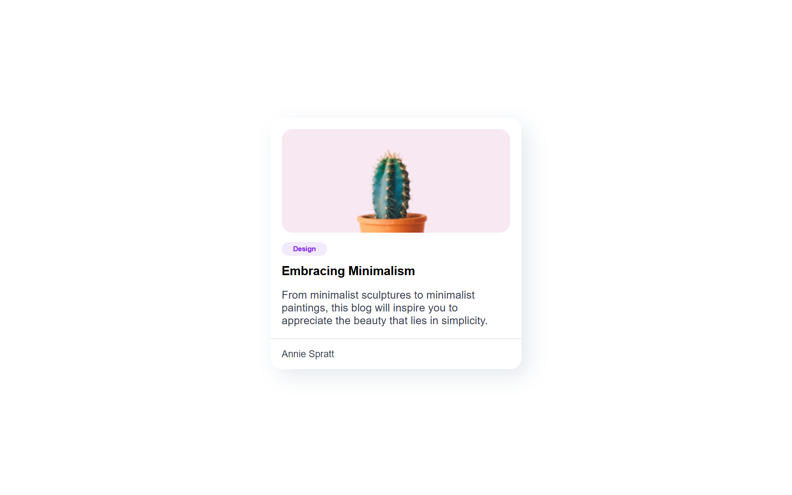
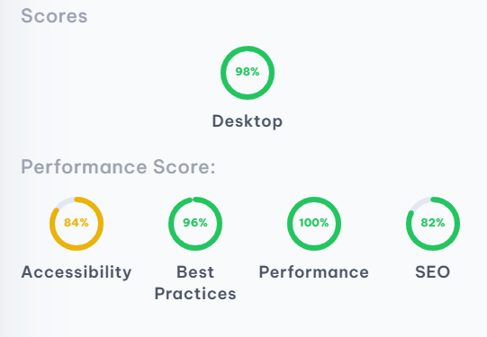

<!-- Please update value in the {}  -->

<h1 align="center">Simple Blog Card | devChallenges</h1>

   Solution for a challenge <a href="https://devchallenges.io/challenge/minimal-blog-card" target="_blank">Minimal Blog Card</a> from <a href="http://devchallenges.io" target="_blank">devChallenges.io</a>

  <h3>
    <a href="https://arza707.github.io/Simple-Blog-Card/">
      Demo
    </a>
     | 
    <a href="https://devchallenges.io/solution/54610">
      Solution
    </a>
     | 
    <a href="https://devchallenges.io/challenge/minimal-blog-card">
      Challenge
    </a>
  </h3>

<!-- TABLE OF CONTENTS -->

## Table of Contents

- [Overview](#overview)
  - [What I learned](#what-i-learned)
  - [Useful resources](#useful-resources)
- [Built with](#built-with)
- [Author](#Author)

<!-- OVERVIEW -->

## Overview

<!--
Introduce your projects by taking a screenshot or a gif. Try to tell visitors a story about your project by answering:

- What have you learned/improved?
- Your wisdom? :)
-->

### What I learned

- Build a simple blog card
- Problem solving
- Learn how to use CSS Flexbox

### Useful resources

- [DevChallenges](https://devchallenges.io/)
- [BroCode HTML 1 Hour](https://youtu.be/HD13eq_Pmp8?si=plMbG-LvwLPuJWEz)
- [BroCode CSS 1 Hour](https://youtu.be/wRNinF7YQqQ?si=s33Uahn7R9zf0904)

### Built with

<!-- This section should list any major frameworks that you built your project using. Here are a few examples.-->

- HTML
- CSS 
- Visual Studio Code

### Author

- Website [Simple Blog Card](https://arza707.github.io/Simple-Blog-Card/)
- GitHub [@Arza707](https://github.com/Arza707)
